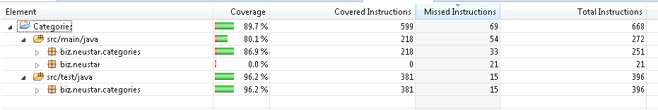

# Categories

Process the file which contains Categories and their sub-categories.

We need to pass the file name as argument.

### Prerequisites:

1. Java version greater than or equal 1.8

### External libraries used : 
1. Junit
2. hamcrest-core

### Algorithm:

1. Read each line from the file.
2. Remove duplicated lines from file by adding the lines into uniqueLinesSet.
3. Remove Invalid Categories from uniqueLinesSet.
4. Count repeated valid categories, and add the count in validCategories Map(Category as key and Count as value).
5. By using validCategories Map print the categoryCountMap to console.
6. By using uniqueLinesSet print the categories to console.

### How to run:

1. Run from the IDE 
     Run as java application Categories by passing the filename as argument
 
 
####File Input:
- PERSON Bob Jones
- PLACE Washington
- PERSON Mary
- COMPUTER Mac
- PERSON Bob Jones
- OTHER Tree
- ANIMAL Dog
- PLACE Texas
- FOOD Steak
- ANIMAL Cat

####Output:
Category	Count  
PERSON	    2  
PLACE	    2  
ANIMAL	    2  
COMPUTER	1  
OTHER	    1   

PERSON Bob Jones  
PLACE Washington  
PERSON Mary  
COMPUTER Mac  
OTHER Tree  
ANIMAL Dog  
PLACE Texas  
ANIMAL Cat  

###Code Coverage:
Installed Jacoco plugin in Eclipse, and right click on CategoryFileTest.java file Coverage As Junit Test. and got the below report.  
   
   

###PMD: 
Installed PMD plugin in Eclipse, and right click on project-> PMD -> Check Code.and not found any critical violations.
 